Channel information
===================
    

Channel information at: T = 35.0 degC, E_rev = 0 mV, [Ca2+] = 5e-05 mM

<table>
    <tr>
<td width="120px">
            <b>NaxSH0_ChannelML</b> 
            <a href="../NaxSH0_ChannelML.channel.nml">NaxSH0_ChannelML.channel.nml</a> 
            <b>Ion: na</b> 
            <i>g = gmax * m3 * h </i> 
            Na Channel
</td>
<td>
<a href="NaxSH0_ChannelML.inf.png">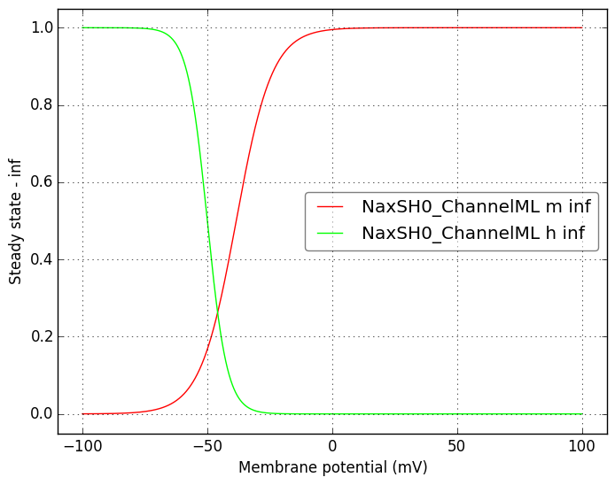</a>
</td>
<td>
<a href="NaxSH0_ChannelML.tau.png">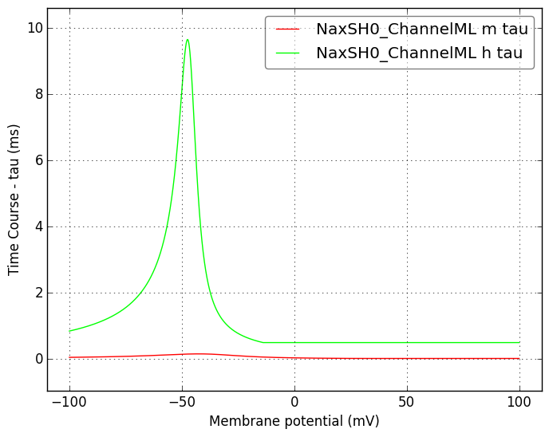</a>
</td>
</tr>
    <tr>
<td width="120px">
            <b>NaxSH10_ChannelML</b> 
            <a href="../NaxSH10_ChannelML.channel.nml">NaxSH10_ChannelML.channel.nml</a> 
            <b>Ion: na</b> 
            <i>g = gmax * m3 * h </i> 
            Na Channel
</td>
<td>
<a href="NaxSH10_ChannelML.inf.png">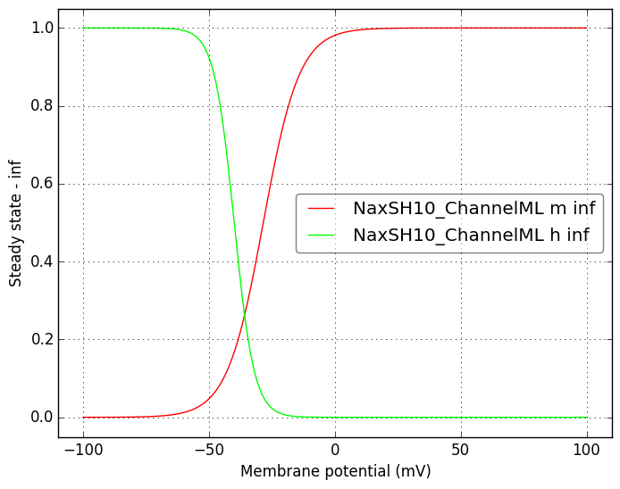</a>
</td>
<td>
<a href="NaxSH10_ChannelML.tau.png">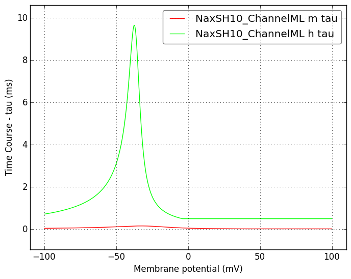</a>
</td>
</tr>
    <tr>
<td width="120px">
            <b>NaP_iAMC_ChannelML</b> 
            <a href="../NaP_iAMC_ChannelML.channel.nml">NaP_iAMC_ChannelML.channel.nml</a> 
            <b>Ion: na</b> 
            <i>g = gmax * m3 * h * n </i> 
            Na Channel
</td>
<td>
<a href="NaP_iAMC_ChannelML.inf.png">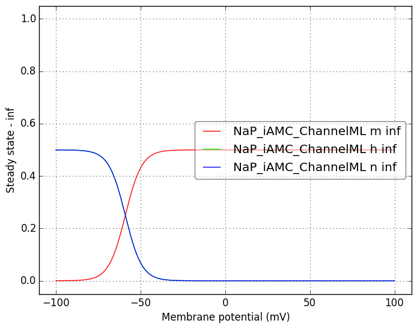</a>
</td>
<td>
<a href="NaP_iAMC_ChannelML.tau.png">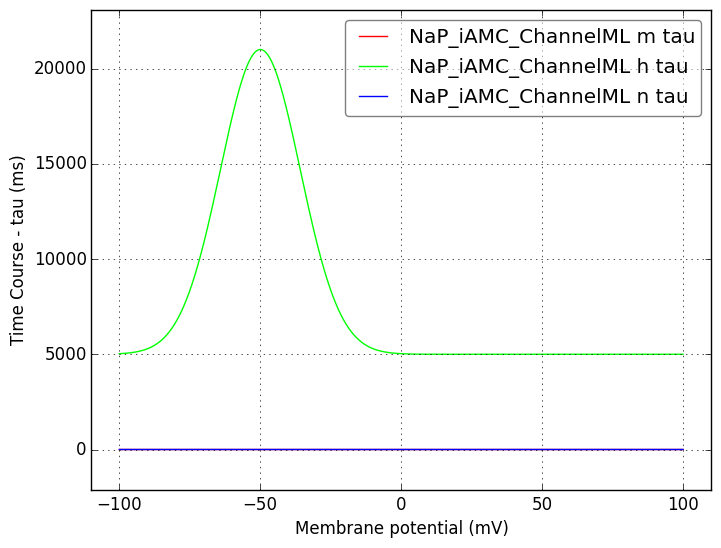</a>
</td>
</tr>
    <tr>
<td width="120px">
            <b>Kdr_iAMC_ChannelML</b> 
            <a href="../Kdr_iAMC_ChannelML.channel.nml">Kdr_iAMC_ChannelML.channel.nml</a> 
            <b>Ion: k</b> 
            <i>g = gmax * m * n </i> 
            Mitral cell K DR channel
</td>
<td>
<a href="Kdr_iAMC_ChannelML.inf.png">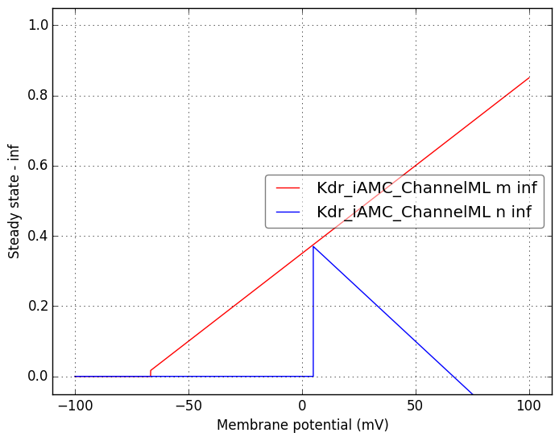</a>
</td>
<td>
<a href="Kdr_iAMC_ChannelML.tau.png">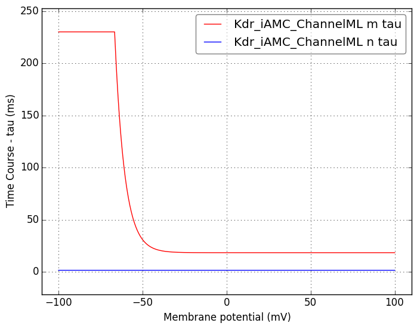</a>
</td>
</tr>
    <tr>
<td width="120px">
            <b>KA_iAMC_ChannelML</b> 
            <a href="../KA_iAMC_ChannelML.channel.nml">KA_iAMC_ChannelML.channel.nml</a> 
            <b>Ion: k</b> 
            <i>g = gmax * m * h </i> 
            A-type K channel, with rate equations expressed in tau and inf form
</td>
<td>
<a href="KA_iAMC_ChannelML.inf.png">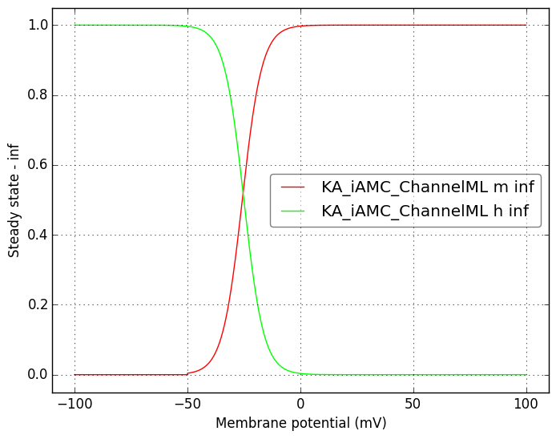</a>
</td>
<td>
<a href="KA_iAMC_ChannelML.tau.png">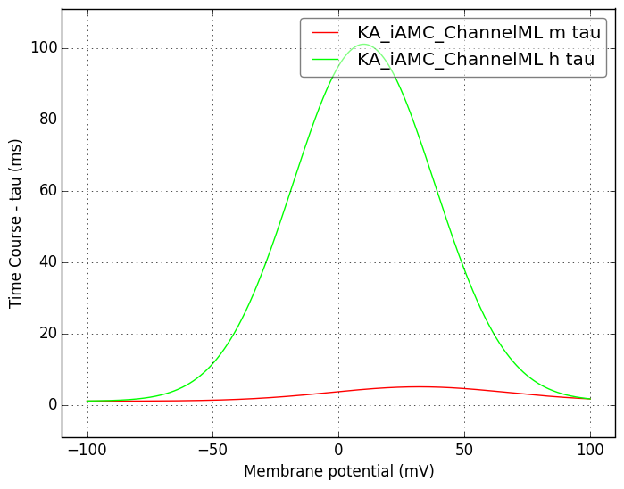</a>
</td>
</tr>
    <tr>
<td width="120px">
            <b>BK_IAMC_ChannelML</b> 
            <a href="../BK_IAMC_ChannelML.channel.nml">BK_IAMC_ChannelML.channel.nml</a> 
            <b>Ion: k</b> 
            <i>g = gmax * m * n </i> 
            Calcium dependent K+ channel
</td>
<td>
<a href="BK_IAMC_ChannelML.inf.png">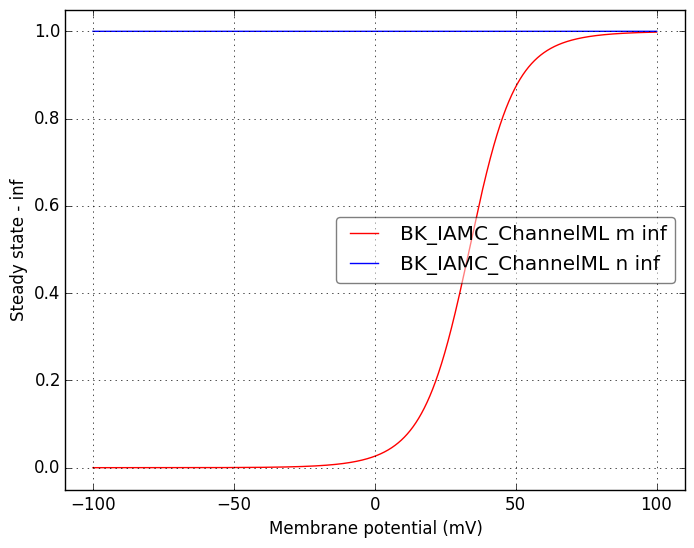</a>
</td>
<td>
<a href="BK_IAMC_ChannelML.tau.png">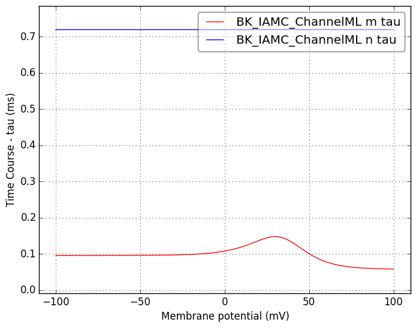</a>
</td>
</tr>
    <tr>
<td width="120px">
            <b>CaV_R_iAMC_ChannelML</b> 
            <a href="../CaV_R_iAMC_ChannelML.channel.nml">CaV_R_iAMC_ChannelML.channel.nml</a> 
            <b>Ion: ca</b> 
            <i>g = gmax * m2 * h </i> 
            A High Voltage Activated Ca2+ channel
</td>
<td>
<a href="CaV_R_iAMC_ChannelML.inf.png">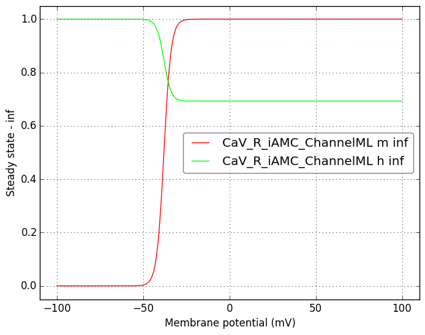</a>
</td>
<td>
<a href="CaV_R_iAMC_ChannelML.tau.png">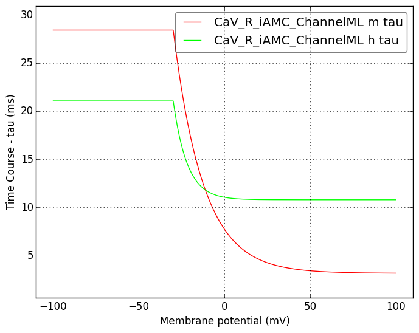</a>
</td>
</tr>
</table>

